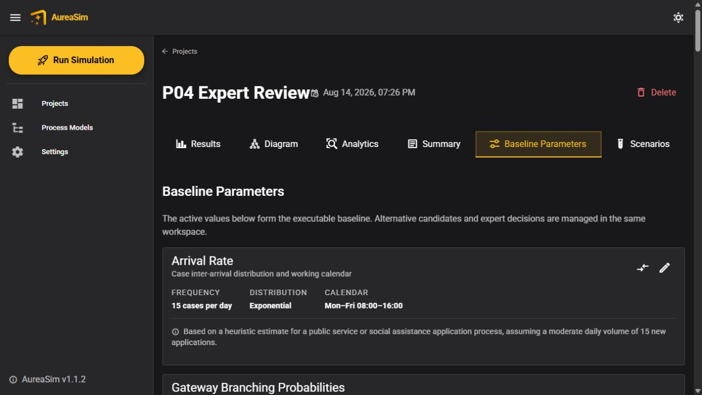
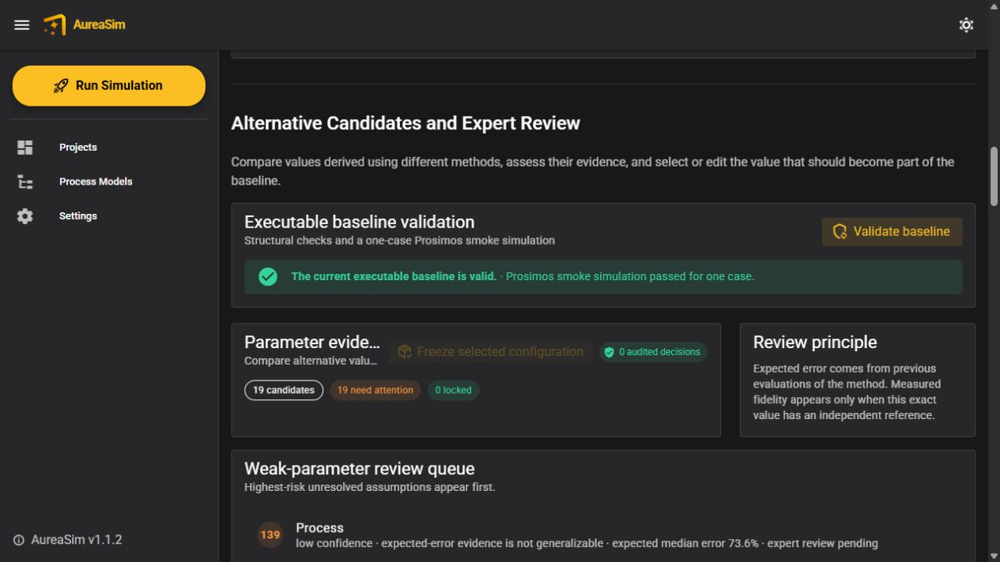

# Parameter evidence, review, and validation workflow

This guide explains how AureaSim turns proposed simulation parameters into an
executable, reviewed baseline. The complete workflow is available in the
**Baseline Parameters** tab of a project.

## Four objects that must not be confused

| Object | Meaning |
|---|---|
| Candidate | One possible value for one parameter, together with its method, evidence, uncertainty, reliability, fidelity, and review state. |
| Baseline | The active, complete Prosimos configuration used as the reference simulation. There is always one executable value per required parameter. |
| Scenario | A deliberate change relative to the baseline, such as greater demand or reduced staffing. It is not another parameter-estimation method. |
| Result | Output from a simulation run. Results become stale when the active baseline changes. |

Rejecting a candidate only removes that alternative from consideration. It
does not delete the active baseline value and therefore does not make the
simulation impossible.

## End-to-end user workflow

1. **Create or open a project.** AureaSim generates an initial executable
   baseline from the BPMN model and process description.
2. **Initialize the evidence workspace.** On first opening the tab, AureaSim
   automatically represents every supported value in the executable baseline
   as a candidate and records its generation method and baseline provenance.
   Compatible external research packages remain available under **Advanced
   candidate import**.
3. **Compare evidence.** Candidates are grouped by the exact parameter they can
   replace. The view displays their method, value, confidence grade, expected
   error, measured fidelity, evidence count, and review state.
4. **Investigate weak values.** The review queue places low-confidence,
   high-error, non-generalizable, and unreviewed values first.
5. **Search for analogous tasks when appropriate.** The history button beside a
   task queries the calibration-only historical repository. AureaSim excludes
   the target process and creates a candidate only when the frozen similarity,
   process-diversity, and sample-size requirements are met. An empty result is a
   valid outcome; the application does not lower the thresholds. A synthetic
   working example and preparation instructions are available in
   [`historical_tasks/README.md`](../local_evidence/historical_tasks/README.md).
6. **Record expert decisions.** An expert can accept, edit, reject, or lock a
   candidate. Every action requires a stable reviewer identifier and a reason.
   Decisions are appended to a versioned, hash-chained audit ledger.
7. **Select the active values.** **Use in baseline** writes an executable task
   duration, interarrival, resource cost, resource capacity, or gateway-path
   candidate into the Prosimos baseline and records the previous value,
   selected candidate, reviewer, justification, and time.
   Diagnostic-only measures such as queue or handoff delay remain visible but
   cannot be substituted into an unsupported Prosimos field.
8. **Edit remaining assumptions.** Baseline arrival, task duration, resource,
   and gateway controls support justified manual refinement. Such changes
   invalidate prior simulation results and prior baseline validation.
9. **Validate the complete baseline.** **Validate baseline** checks BPMN task
   and gateway references, resource profiles and calendars, task assignments,
   gateway probability sums, and distribution representations. If structural
   checks pass, AureaSim runs a one-case Prosimos smoke simulation.
10. **Freeze the configuration.** A hybrid configuration can be frozen only
    while validation is current and successful. Its ZIP contains the executable
    `AutoGenerated_Base_params.json` and `hybrid_selection.json`, which records
    selected candidates and retained assumptions.
11. **Run scenarios and inspect results.** Scenarios are evaluated relative to
    the validated baseline. Reports are downloaded from the **Summary** tab.

## Interpreting evidence labels

- **Method** identifies how the value was derived: generic-label heuristic,
  semantic-label heuristic, web-grounded evidence, process-mining calibration,
  historical analogue, expert refinement, or hybrid selection.
- **Confidence** is a simple reliability grade. It is not the probability that
  a particular value is correct.
- **Expected error** is estimated from independent prior evaluations of the same
  method and parameter family. It is shown only where those results are judged
  transferable; otherwise it is marked unknown or non-generalizable.
- **Measured fidelity** is the observed distance from an independent reference
  for that exact candidate. It must not be inferred from confidence or expected
  error.
- **Evidence records** identify the source, its SHA-256 digest, the data split,
  sample size, and relevant notes.

High confidence does not guarantee low downstream simulation error. Parameters
can interact, and resource capacity, calendars, queues, branching, arrivals,
and task durations should be assessed jointly through simulation.

## Process-mining safeguards

- Completed cases are used for duration and cycle-time analysis.
- Human execution duration is `end_date - acq_date`, where `acq_date` is the
  acquisition by the final executor who completes the task.
- Queue entry, first acquisition, final acquisition, completion, releases,
  delegations, and escalations remain separate concepts.
- Invalid or non-monotonic intervals are excluded from duration statistics.
- Calibration candidates may use only the chronological calibration split.
  Selection data are reserved for method choice and hold-out data for final
  assessment.
- Operational cost fidelity is not reported because the source systems do not
  store resource costs.
- Calendars remain declared assumptions unless independently established.
- Resource allocation is a deliberate scenario intervention; it is not inferred
  as an initial-value candidate. Waiting time and throughput are simulation
  outputs, not Prosimos input parameters. Exclusive-gateway path probabilities
  can be derived from calibration traces only when BPMN alignment identifies a
  unique predecessor/path/successor transition; ambiguous routes are retained
  as uncovered rather than imputed.

## Files written to a project

| File or directory | Purpose |
|---|---|
| `AutoGenerated_Base_params.json` | Current executable baseline. |
| `parameter_candidates.json` | Typed candidates and their evidence. |
| `parameter_candidate_audit.json` | Hash-chained expert-review events. |
| `parameter_selection_history.json` | Audited applications to the baseline. |
| `baseline_edit_history.json` | Justified direct baseline edits. |
| `baseline_validation.json` | Validation result tied to exact baseline and BPMN hashes. |
| `.validation/<hash>/` | Sanitized smoke-test inputs and the one-case event log. |
| `hybrid_configurations/<id>/` | Frozen selection manifest and executable snapshot. |
| `gateway_probability_estimates` | Calibration-split exclusive-gateway estimates emitted by the process-miner connector when `--bpmn-root` is supplied. |

## Current scope

Candidate substitution supports task execution-duration and process
interarrival distributions, resource costs, and gateway-path probabilities.
Resource capacity is managed as a baseline assumption and a scenario control.
Other mined measures remain diagnostic until a semantically correct Prosimos
mapping is implemented. Multi-expert consensus, continuous
drift monitoring, automatic online recalibration, learned similarity weights,
and organization-wide repository administration are future work.
